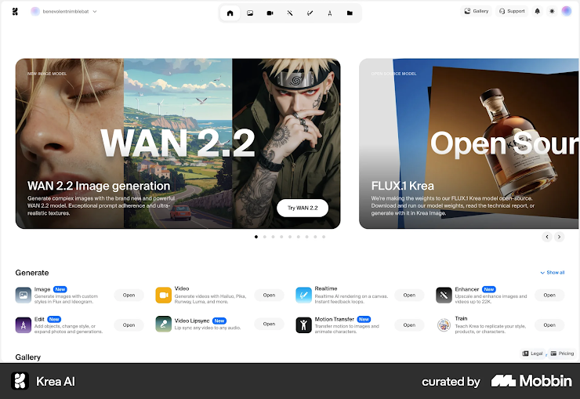

# CARTOLINK ASSIGNMENT

## 🚀 Features
- Effective Scroll Buttons
- Dark mode
- Mobile Responsiveness

## 🛠️ Tech Stack
- Next.js
- TailwindCSS (NativeWind)
- Typescript

## 📸 Screenshots


## ⚙️ Installation

Clone the repository:
```bash
git clone  https://github.com/shittu-qudus/cartolink.git
cd my-app

├── carttolink web
├── my-app
├── pages
├── public
├── /styles    
├── /package.json       
├── /tailwind.config.js      
└── README.md
